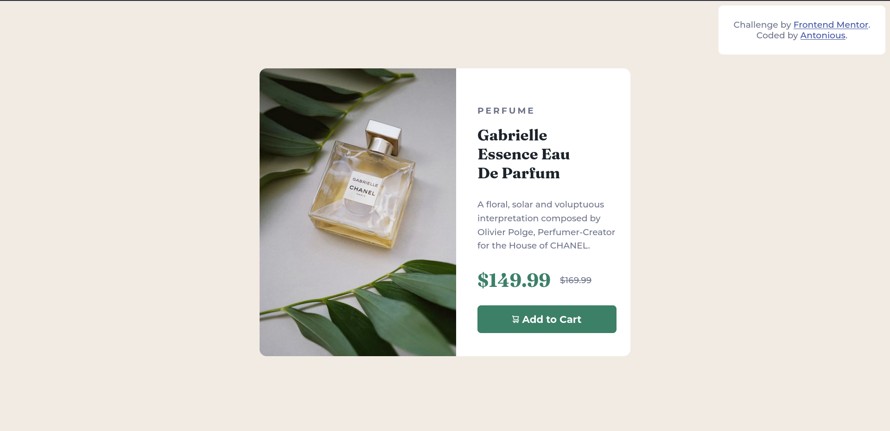

# Frontend Mentor - Product preview card component solution

This is a solution to the [Product preview card component challenge on Frontend Mentor](https://www.frontendmentor.io/challenges/product-preview-card-component-GO7UmttRfa). Frontend Mentor challenges help you improve your coding skills by building realistic projects. 

## Table of contents

- [Overview](#overview)
  - [The challenge](#the-challenge)
  - [Screenshot](#screenshot)
  - [Links](#links)
- [My process](#my-process)
  - [Built with](#built-with)
  - [Useful resources](#useful-resources)
- [Author](#author)

## Overview

### The challenge

Users should be able to:

- View the optimal layout depending on their device's screen size
- See hover and focus states for interactive elements

### Screenshot

### Links

- Solution URL: [here](https://github.com/Antonious-Awad/product-preview-card-component)
- Live Site URL: [here](https://antonious-awad.github.io/product-preview-card-component/)

## My process

### Built with

- Semantic HTML5 markup
- CSS custom properties
- Flexbox

### Useful resources

- [background-position css property](https://developer.mozilla.org/en-US/docs/Web/CSS/background-position) - This helped me for understanding the positioning on images in a div without having to use an `` element, I really liked this pattern and will use it going forward.
## Author
- Frontend Mentor - [@Antonious-Awad](https://www.frontendmentor.io/profile/Antonious-Awad)
- Twitter - [@Antonious_A](https://www.twitter.com/Antonious_A)